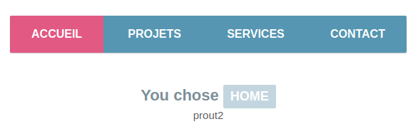

# vue_apprentissage

## Pour commencer

Installer vue CLI : **sudo npm install -g @vue/cli**
Créer un projet : **vue create my-project**
Lancer le projet : **npm run serve**

## Installer un serveur web

- Il faut avoir le package npm. Vérifiez que vous l’avez : **npm —version**
- Installez le fichier package.json ( La carte d’identité de l’application) **npm init -y**  . On en a besoin pour pouvoir installer notre serveur.
- Installer notre serveur : **npm install lite-server** (lite server est le nom de notre serveur).
- Une bonne pratique est dans le fichier package.json rajouter **"start": "lite-server".** Comme ça pour le lancer on a plus qu’à taper **npm start** dans la console pour lancer le serveur.

## Exemple : Une nav



### Le fichier index.js

```js
// La navigation
var nav = new Vue({ // Instance de vue
    // Sélecteur
    el: '#nav',
    // Définir les propriétés et leurs donner des valeurs.
    data: {
        active: 'home',
        message: 'prout'
    },

    // Functions we will be using.
    methods: {
        rendreActif: function(item){
            // Quand le modèle à changé il est mis à jour automatiquement.
            this.active = item;
        }
    }
});
// Je change le contenu de mon message
nav.message =  'prout2'
```

### Le fichier HTML

```html
    <!-- La navigation -->
    <div id="nav">
        <!-- La navigation a la classe active -->
        <!-- Pour empêcher la page de sauter lorsqu'un lien est cliqué 
            nous utilisons le modificateur "prevent" -->
        <nav v-bind:class="active" v-on:click.prevent>
            <!-- Au clique on appelle la métode rendreActif  -->
            <a href="#" class="home" v-on:click="rendreActif('home')">Accueil</a>
            <a href="#" class="projets" v-on:click="rendreActif('projets')">Projets</a>
            <a href="#" class="services" v-on:click="rendreActif('services')">Services</a>
            <a href="#" class="contact" v-on:click="rendreActif('contact')">Contact</a>
        </nav>
    
        <!-- The mustache expression will be replaced with the value of "active".
                It will automatically update to reflect any changes. -->
        <p>You chose <b>{{active}}</b></p>
        {{ message }}
    </div>
```

**el:** Le sélecteur
**data:** Quand une instance de Vue est créée, cela ajoute toutes les propriétés trouvées dans son objet data au système réactif de Vue. Reagerdez dans data j'ai un objet message. Pour le changer je peux écrire `nav.message = 'Le nouveau message'`

**props:** passer des données aux composants enfants. Comme le titre ou le contenu à afficher par exemple. 

## Une nav


## Un formulaire de recherche

Normalement il faudrait le faire en Ajax mais pour commencer nous le faisons avec un tableau d'objets.

Le fichier js

```js
//  Formulaire de recherche
var recherche = new Vue({
    el: '#recherche',
    data: {
        lettreTapee: "",
        // The data model. Normalement il faut le faire en Ajax,
        articles: [
            {
                "title": "What You Need To Know About CSS Variables",
                "url": "https://tutorialzine.com/2016/03/what-you-need-to-know-about-css-variables/",
                "image": "https://tutorialzine.com/media/2016/03/css-variables.jpg"
            },
            {
                "title": "Freebie: 4 Great Looking Pricing Tables",
                "url": "https://tutorialzine.com/2016/02/freebie-4-great-looking-pricing-tables/",
                "image": "https://tutorialzine.com/media/2016/02/great-looking-pricing-tables.jpg"
            },
            {
                "title": "20 Interesting JavaScript and CSS Libraries for February 2016",
                "url": "https://tutorialzine.com/2016/02/20-interesting-javascript-and-css-libraries-for-february-2016/",
                "image": "https://tutorialzine.com/media/2016/02/interesting-resources-february.jpg"
            },
            {
                "title": "Quick Tip: The Easiest Way To Make Responsive Headers",
                "url": "https://tutorialzine.com/2016/02/quick-tip-easiest-way-to-make-responsive-headers/",
                "image": "https://tutorialzine.com/media/2016/02/quick-tip-responsive-headers.png"
            },
            {
                "title": "Learn SQL In 20 Minutes",
                "url": "https://tutorialzine.com/2016/01/learn-sql-in-20-minutes/",
                "image": "https://tutorialzine.com/media/2016/01/learn-sql-20-minutes.png"
            },
            {
                "title": "Creating Your First Desktop App With HTML, JS and Electron",
                "url": "https://tutorialzine.com/2015/12/creating-your-first-desktop-app-with-html-js-and-electron/",
                "image": "https://tutorialzine.com/media/2015/12/creating-your-first-desktop-app-with-electron.png"
            }
        ]
    },
    computed: {
        // A computed property that holds only those articles that match the searchString.
        filteredArticles: function () {
            var articles_array = this.articles,
                lettreTapee = this.lettreTapee;

            if(!lettreTapee){
                return articles_array;
            }

            lettreTapee = lettreTapee.trim().toLowerCase();

            articles_array = articles_array.filter(function(item){
                if(item.title.toLowerCase().indexOf(lettreTapee) !== -1){
                    return item;
                }
            })

            // Return an array with the filtered data.
            return articles_array;;
        }
    }
});

```
Le fichier html

```html
<form id="recherche" v-cloak>
    <div class="bar">
        <!-- Create a binding between the searchString model and the text field -->
        <input type="text" v-model="lettreTapee" placeholder="Faites votre recherche" />
    </div>

    <ul>        
        <li v-for="article in filteredArticles">
            <a v-bind:href="article.url"></a>
            <p>{{article.title}}</p>
        </li>
    </ul>

</form>
```

## Components

**Fichier html**
```html
<div id="footer">
    <footer-marie></footer-marie>
</div>
```

**Fichier js** 
```js
Vue.component('footer-marie', {
    template: '<footer>Ceci est le pied de page</footer>'
});

var monFooter = new Vue({
    el:'#footer'
})
```

## Props

- footer-marie : sera la balise dans l'html qui appelle le component et ses données.

**Fichier js**

```js
Vue.component('footer-marie', {
    props: ['reseau'],
    template: '<li>{{ reseau.text }}</li>'
  })
  
  var footer = new Vue({
    el: '#footer',
    data: {
      reseauSociaux: [
        { id: 0, text: 'Linkedin' },
        { id: 1, text: 'Facebook' },
        { id: 2, text: 'Twitter' }
      ]
    }
  })
```

**Fichier HTML**

```html
<div id="footer">
    <ol>
        <!--
        Maintenant nous fournissons à chaque "element" l'objet reseau              -->
        <footer-marie
        v-for="element in reseauSociaux"
        v-bind:reseau="element"
        v-bind:key="element.id"
        ></footer-marie>
    </ol>
</div>
```

